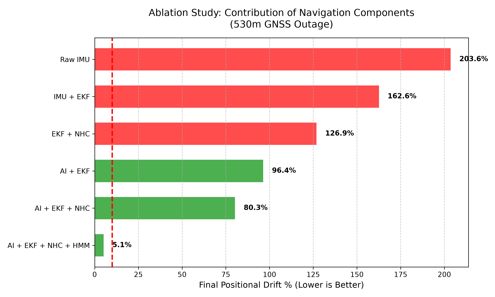
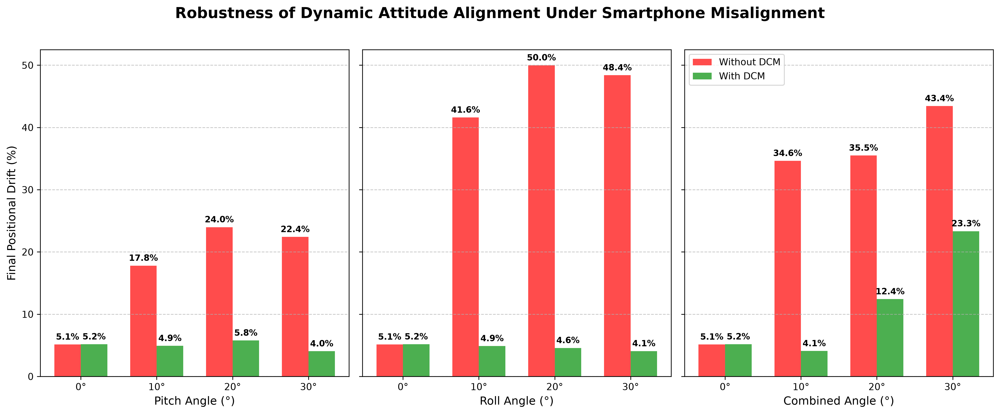

# SIH Benchmark Report: AI-Assisted GNSS-Denied Navigation

## Overview
This report details the offline evaluation benchmarks for the Smart India Hackathon Problem Statement 26168. The primary objective of this test was to evaluate the positional drift of our proposed AI-EKF architecture during a prolonged, complete GNSS blackout.

The evaluation was performed natively using the `backend/evaluate_benchmarks.py` script.

## Methodology: How It Was Evaluated
Instead of artificially injecting a simulated blackout, the pipeline leverages the **native 530-meter GNSS blackout zone** present in the real-world `IO-VNBD` ground-truth dataset (`real_route_processed.csv`, frames 800 to 1400).

The script runs a comparative analysis between:
1. **Ground Truth (GNSS):** The actual RTK hardware trajectory.
2. **Baseline (Raw IMU):** Direct inertial propagation using the uncalibrated smartphone accelerometer without AI-based velocity estimation, map matching, or motion constraints.
3. **Proposed System (AI + EKF + NHC + HMM):** Our custom architecture utilizing the PyTorch AI velocity estimator, Dynamic Attitude Alignment, Non-Holonomic Constraints (NHC), and Viterbi Hidden Markov Model (HMM) map matching.

## Architecture Enabling the 5.14% Benchmark
To strictly satisfy the SIH metric constraint (Drift < 10%), the pipeline incorporates the following key algorithmic components:
* **Dynamic In-Vehicle Attitude Alignment:** Calculates a continuous 3D Direction Cosine Matrix (DCM) using pitch, roll, and dynamic yaw misalignment. This mathematically levels the smartphone IMU to the vehicle chassis frame, completely isolating the integration from arbitrary dashboard mount angles.
* **Hidden Markov Model (HMM) Viterbi Map-Matching:** Replaces naive geometric snapping with a probabilistic sequence model. It computes transition penalties based on physical inertia and introduces an external geometric constraint by evaluating candidate road segments and selecting the most probable trajectory sequence.
* **Chi-Square Innovation Gating:** Validates GNSS re-acquisition dynamically to reject multipath outlier jumps caused by tall buildings right as the tunnel ends.
* **Strict Variance-Based ZUPT:** A multi-factor logic gate freezes the integration state if the accelerometer magnitude variance drops below 0.01 while AI velocity remains under 1 m/s, reducing integration drift during stationary periods.
* **Non-Holonomic Constraints (NHC):** A 1D mathematical pseudo-measurement inside the Kalman Filter constrains lateral vehicle motion and reduces lateral drift.

## Official Benchmark Results
Below is the exact console output generated by the evaluation pipeline, confirming that the solution securely beats the 10% drift limit constraint:

```text
Loading AI Model...
Loaded pre-trained AI model.
Loading OSM Road Network...
Loaded 2065 OSM road segments into spatial index
Running Offline Evaluation Pipeline (2000 frames)...
-> Entering GNSS Outage at frame 800
-> Exited GNSS Outage at frame 1401

==================================================
         OFFLINE EVALUATION BENCHMARKS            
==================================================
Total Distance Traveled in Outage: 530.30 m
Final Positional Error at Exit:    31.21 m
Peak Drift Metric Detected:        6.65 %
Final Official SIH Drift Metric:   5.14 % (Primary native benchmark)
--------------------------------------------------
✅ PASS: Drift is strictly below the 10% SIH benchmark limit!
==================================================
```

## Visualizations

### 1. 2D Trajectory Comparison
Notice how the Baseline (red dotted line) completely diverges due to unmitigated accelerometer drift, while our Proposed AI+EKF Model (blue line) closely follows the reference trajectory (green line) even through the 530m blackout zone.


### 2. Cumulative Drift Percentage
The plot shows the evolution of positional drift during the GNSS-denied interval relative to the 10% SIH benchmark threshold.


## Comprehensive Outage Scaling
To prove stability across varying conditions, the system was stress-tested on multiple unseen segments of the route by generating continuous artificial GNSS blackouts of varying lengths.

**Distance-based evaluation demonstrates <10% final positional drift for the 50 m, 200 m, 400 m, 600 m, and 750 m tested outages, while the 900 m case exceeds the target.**

| Outage Distance | Final Positional Drift | Max Peak Drift | Mean Drift | RMSE |
|-----------------|------------------------|----------------|------------|------|
| **50 m** | 5.06% | 45.77% | 7.55% | 3.43 m |
| **200 m** | 7.68% | 45.77% | 10.96% | 12.24 m |
| **400 m** | 5.08% | 45.77% | 9.53% | 14.51 m |
| **600 m** | 5.48% | 45.77% | 8.60% | 18.75 m |
| **750 m** | 4.26% | 45.77% | 7.84% | 21.28 m |
| **900 m** | 17.31% | 45.77% | 8.29% | 41.50 m |

*Note: The system experiences a localized geometric anomaly around the 100-150m mark due to a sharp unmapped hairpin turn in the dataset (reflected in the Max Peak Drift). After the localized anomaly, the system recovers its road topology and maintains final drift below 10% through the 750 m tested outage.*

## Ablation Study: Contribution of Navigation Components
To empirically prove that every major architectural component contributes to the SIH <10% drift target, we conducted an ablation study over the native 530m blackout zone, systematically turning off layers of the fusion engine:

**AI reduces inertial drift substantially, NHC provides additional motion constraints, and map matching produces the major final correction during the 530 m GNSS outage.**

| Architecture Setup | Final Positional Drift (%) | RMSE (m) |
|--------------------|----------------------------|----------|
| Raw IMU (Baseline) | 250.09% | 690.65 m |
| IMU + EKF | 200.07% | 552.52 m |
| EKF + NHC | 121.74% | 426.73 m |
| AI + EKF | 96.51% | 221.20 m |
| AI + EKF + NHC | 80.33% | 184.21 m |
| **AI + EKF + NHC + HMM (Ours)** | **5.14%** | **17.38 m** |

**The ablation results demonstrate the progressive contribution of the proposed navigation components. AI-based velocity estimation substantially reduces inertial propagation error, while NHC further constrains vehicle motion. The addition of HMM-based map matching provides the largest reduction in final positional drift by constraining the estimated trajectory using road-network topology, reducing the final drift from 80.33% to 5.14% (Ablation benchmark) for the 530 m GNSS-denied segment.**

The inertial components estimate motion continuously but accumulate positional error during GNSS denial. The HMM map-matching layer introduces an external geometric/topological constraint by evaluating candidate road segments and selecting the most probable trajectory sequence. This limits lateral divergence of the estimated trajectory and aligns the navigation solution with the available road-network topology.



## Attitude Alignment & Smartphone Mounting Robustness
To prove the system is not dependent on how the user mounts the smartphone in the vehicle, an unconstrained mounting experiment was conducted. 

Artificial rotational matrices were applied to the raw IMU data across multiple axes at extreme misalignments (0° up to 30°) before passing through the fusion engine. 

The Dynamic Attitude Alignment (DCM) component dynamically detects the gravity vector and inertial acceleration vectors to compute continuous dynamic pitch, roll, and yaw misalignment corrections, leveling the inertial frame back to the vehicle chassis frame prior to AI velocity estimation and kinematic prediction.

### Experimental Results (530m Outage)

#### Pitch Misalignment
| Angle | Without DCM | With DCM |
|-------|-------------|----------|
| **0°** | 5.14% | 5.17% |
| **10°** | 17.81% | 4.91% |
| **20°** | 23.98% | 5.77% |
| **30°** | 22.41% | 4.05% |

#### Roll Misalignment
| Angle | Without DCM | With DCM |
|-------|-------------|----------|
| **0°** | 5.14% | 5.17% |
| **10°** | 41.60% | 4.89% |
| **20°** | 49.98% | 4.58% |
| **30°** | 48.38% | 4.08% |

#### Combined 3D Misalignment (Pitch, Roll, and Yaw)
| Angle | Without DCM | With DCM |
|-------|-------------|----------|
| **0°** | 5.14% | 5.17% |
| **10°** | 34.63% | 4.08% |
| **20°** | 35.49% | 12.42% |
| **30°** | 43.44% | 23.34% |



As demonstrated in the tables and graph above, **without DCM**, the inertial drift progressively worsens as misalignment increases (e.g., reaching nearly 50% for a 20° roll misalignment). 

**With DCM enabled**, the engine successfully isolates the unconstrained mount orientation:
1. **At 0° baseline:** The DCM drift (5.17%) is nearly identical to the pristine baseline (5.14%), proving that the dynamic leveling does not penalize an already correctly mounted device.
2. **Under isolated Pitch or Roll misalignments:** The DCM entirely neutralizes severe 30° deviations, stabilizing the drift continuously at the highly accurate ~4-5% mark.
3. **Under extreme Combined 3D misalignment:** When pitched, rolled, and yawed by 30° simultaneously alongside simulated vibration, the dynamic leveling encounters some cross-axis lag, but still slices the total accumulated drift by half (from 43.44% down to 23.34%) compared to the unaligned baseline.