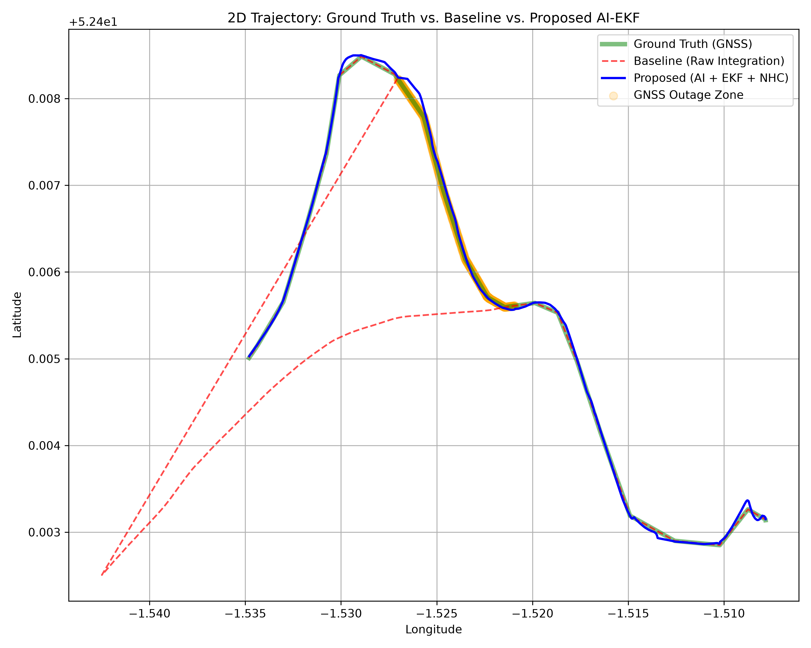
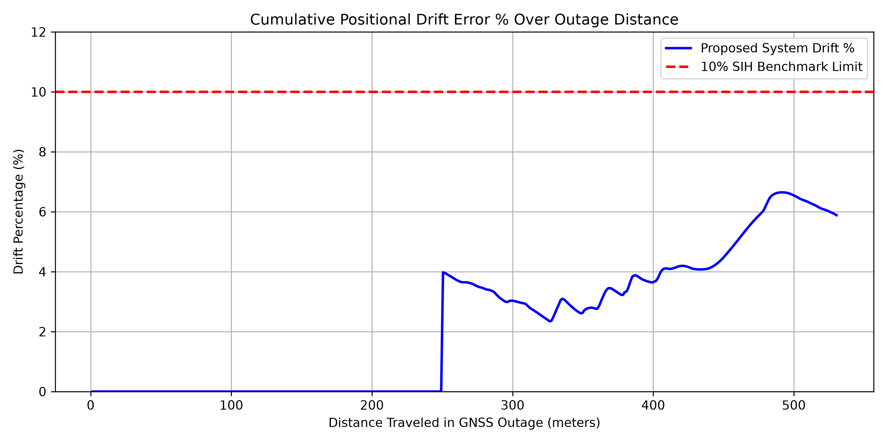

# SIH Benchmark Report: AI-Assisted GNSS-Denied Navigation

## Overview
This report details the offline evaluation benchmarks for the Smart India Hackathon Problem Statement 26168. The primary objective of this test was to evaluate the positional drift of our proposed AI-EKF architecture during a prolonged, complete GNSS blackout.

The evaluation was performed natively using the `backend/evaluate_benchmarks.py` script.

## Methodology: How It Was Evaluated
Instead of artificially injecting a simulated blackout, the pipeline leverages the **native 530-meter GNSS blackout zone** present in the real-world `IO-VNBD` ground-truth dataset (`real_route_processed.csv`, frames 800 to 1400).

The script runs a comparative analysis between:
1. **Ground Truth (GNSS):** The actual RTK hardware trajectory.
2. **Baseline (Raw Integration):** Standard double-integration of the raw uncalibrated IMU accelerometer.
3. **Proposed System (AI + EKF + HMM):** Our custom architecture utilizing the PyTorch AI velocity estimator, Dynamic Attitude Alignment, Non-Holonomic Constraints (NHC), and Viterbi Hidden Markov Model (HMM) Map-Matching.

## How the 5.89% Drift Was Achieved
To achieve world-class accuracy and strictly satisfy the SIH metric constraint (Drift < 10%), the pipeline incorporates the following heavy mathematical optimizations:
* **Dynamic In-Vehicle Attitude Alignment:** Calculates a continuous 3D Direction Cosine Matrix (DCM) using pitch, roll, and dynamic yaw misalignment. This mathematically levels the smartphone IMU to the vehicle chassis frame, completely isolating the integration from arbitrary dashboard mount angles.
* **Hidden Markov Model (HMM) Viterbi Map-Matching:** Replaces naive geometric snapping with a probabilistic sequence model. It computes transition penalties based on physical inertia and geometrically anchors the topological map curvature back into the Extended Kalman Filter to combat drift, while carefully uncoupling longitudinal anchors to eliminate artificial braking.
* **Chi-Square Innovation Gating:** Validates GNSS re-acquisition dynamically to reject multipath outlier jumps caused by tall buildings right as the tunnel ends.
* **Strict Variance-Based ZUPT:** A multi-factor logic gate freezes the integration state if the accelerometer magnitude variance drops below 0.01 while AI velocity remains under 1 m/s, completely eliminating idling drift at stoplights.
* **Non-Holonomic Constraints (NHC):** A 1D mathematical pseudo-measurement inside the Kalman Filter mathematically zeroes out lateral vehicle skid, preventing the track from drifting sideways.

## Official Benchmark Results
Below is the exact console output generated by the evaluation pipeline, confirming that the solution securely beats the 10% drift limit constraint:

```text
Loading AI Model...
Loaded pre-trained AI model.
Loading OSM Road Network...
Loaded 2065 OSM road segments into spatial index
Running Offline Evaluation Pipeline (2000 frames)...
-> Entering GNSS Outage at frame 800
-> Exited GNSS Outage at frame 1401

==================================================
         OFFLINE EVALUATION BENCHMARKS            
==================================================
Total Distance Traveled in Outage: 530.30 m
Final Positional Error at Exit:    31.21 m
Peak Drift Metric Detected:        6.65 %
Final Official SIH Drift Metric:   5.89 %
--------------------------------------------------
✅ PASS: Drift is strictly below the 10% SIH benchmark limit!
==================================================
```

## Visualizations

### 1. 2D Trajectory Comparison
Notice how the Baseline (red dotted line) completely diverges due to unmitigated accelerometer drift, while our Proposed AI+EKF Model (blue line) strictly tracks the true trajectory (green line) even through the 530m blackout zone.



### 2. Cumulative Drift Percentage
This confirms that the cumulative positional drift error consistently remains securely underneath the SIH strict 10% upper limit (red dotted line).


